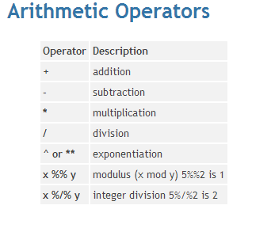

# Introdução

Vamos estudar conceitos e operações básicas da linguagem R antes de adentrar no conteúdo atuarial. Sendo assim, vamos estudar inicialmente:

1. Os tipos de objetos: *vetor, matriz e data frame*
2. Importando dados *.txt* e *.csv* 
3. Funções básicas
4. Operações condicionais
5. Criando Funções

Após essa breve introdução, estudaremos como utilizar a linguagem R para resolver os problemas atuariais, em específico da teoria do risco descritos a seguir:

1. Distribuições de Probabilidade 
2. Inferência Paramétrica
3. Testes de Aderência
4. Distribuições Agregadas de Sinistros
5. Resseguros 

# Operações Básicas no R

### Atribuição de variáveis

A criação de variáveis no `R` é realizada da forma a seguir:

```{r}
# Criar a variável x que receberá o valor 10
x <- 10
```

Usa-se o símbolo `<-` ou `=` para atribuir o valor 10 à `x`.

Se desejar escrever algum comentário no bloco de código, use `#` antes do texto. O que vier após não será computado no R.

Ex.: Crie duas variáveis, X (valor) e N (quantidade), recebendo 50 e 3, respectivamente. Faça também um comentário, para cada variável, detalhando o seu nome:

```{r}
X <- 50 
N <- 3
```

### Operações matemáticas

Os operadores matemáticos utilizados no `R` são:



Vamos praticar a seguir:

```{r}
# adição: 2 + 2
2+2

# subtração: 50 - 5
50-5

# multiplicação: 10 * 40
10*40

# divisão: 55 / 3
55/3

# exponenciação: 2 ^ 5
2^5

# resto da divisão: 6 %% 4
6%%4

# divisão inteira: 6 %/% 4
6%/%4
```

Sua vez de exercitar:

```{r}
# adicione 30 à X

```

```{r}
# Subtraia 3 de N

```

```{r}
# Eleve 3 ao cubo

```

```{r}
# calcule o resto da divisão de 30 por 7

```

```{r}
# Calcule o valor da divisão inteira de 9 por 4

```

Para realizar várias operações matemáticas, como por exemplo 2*5 + 3^5, é importante colocar os parênteses `()` entre as operações:

```{r}
(2*5) + 3^5
```

Então, calcule o produto de `N` e `X`, adicione a divisão de 9 por 10 e multiplique resultado pela pela subtração de 5 por 2. 

```{r}

```


## Tipos de Objetos

O objeto mais comum no `R` é o vetor, podendo ser representado por:

* números inteiros
* números reais
* números complexos
* valores booleanos - TRUE ou FALSE
* caracteres

### Vetor

A função para criar um vetor é: `c()`. Então, se eu desejo criar um vetor com os valores 1, 2 e 3, utilizo o comando:

```{r}
c(1,2,3) 
```

Nesse caso eu não salvei o vetor, apenas pedi para o R mostrá-lo. 

Para salvar um vetor, utilizo do mesmo conceito de atribuição, ou seja, vou criar um objeto e atribuir o vetor a ele com o símbolo `<-`. Vejamos a seguir a criação de um vetor chamado `meu_vetor` que recebe os valores 1, 5, 10, 20:

```{r}
meu_vetor <- c(1,5,10,20)
```

Perceba que ao executar o código de atribuição, nada é mostrado. Isso ocorre porque você não pediu que fosse mostrado o objeto criado. Para tanto, peça para o R mostrar o objeto digitando o seu nome:

```{r}
meu_vetor
```

Agora é sua vez, crie dois vetores e depois mostre-os, sendo o primeiro chamado `ano` e o segundo chamado `resultado` conforme a tabela a seguir:

   ano   | resultado 
:-------:|:---------:
    2015 | 1000
    2016 | -500
    2017 | 300
    2018 | 440

```{r}

```

#### Operações com vetores

O `R` também permite operações com vetores, pois ele foi criado para operar não apenas com números como uma calculadora normal. Ele utiliza-se do conceito de vetorização, isto é, faz operações com um conjunto de valores (vetores).

Vamos criar um vetor chamado `vec` que receberá uma sequência de 1 a 10; em seguida, adicionaremos dois valores, 1 e 2, ao final de `vec`. 

```{r}
vec <- 1:10
vec
vec <- c(vec, 1, 2)
vec
```

Outra forma de criar uma sequência é usando a função `seq()`. Os argumentos dessa função são:

* from 
* to
* by 

`from` representa o valor inicial da sequência; `to`, o último valor; e `by`, o incremento da sequência. 

Crie uma sequência que inicia em 5 e termina em 100, com o incremento de 15.

```{r}
seq(5, 100, 15)
```

As operações matemáticas com vetores podem ser realizadas de maneira semelhante ao que foi feito com valores singulares. Sendo que você deve tomar cuidado com o comprimento dos vetores.

```{r}
# somando dois vetores y e p
y <- c(4, 10, -1)
p <- c(3, 8, 10)
y + p
```

O `R` executará a soma elemento por elemento. 

Some duas sequências, a primeira iniciando em 1 e terminando em 10, enquanto que a segunda, iniciando em 20 e terminando em 11: 

```{r}

```

Subtraia as mesmas sequências:

```{r}

```

Calcule o produto das sequências:

```{r}

```

A divisão entre as sequências:

```{r}

```

### Matriz

Para se criar uma matriz no `R`, usa-se o comando `matrix(data, nrow, ncol, byrow = FALSE)`.

Portanto, o primeiro argumento representa os dados, que normalmente é um vetor, enquanto que nrow representa a quantidade de linhas, ncol a quantidade de colunas, e byrow = FALSE faz com que a matriz seja preenchida por coluna.

Criaremos uma matriz com 3 linhas e 2 colunas, de 1 a 6:

```{r}
matrix(data = 1:6, nrow = 3, ncol = 2, byrow = FALSE)
```

Se eu desejar uma matriz que seja preenchida por linha, substituo o FALSE por TRUE:

```{r}
matrix(data = 1:6, nrow = 3, ncol = 2, byrow = TRUE)
```

Para criar uma matriz vazia, apenas identifique a quantidade de linhas e colunas desejadas. Fazendo uma matriz vazia com 10 linhas e 6 colunas:

```{r}
matrix(nrow = 10, ncol = 6)
```

E agora, como faço para adicionar valores à matriz vazia? 

Você precisa atribuir valores àos elementos dessa matriz utilizando a indexação, isto é, você diz a posição do elemento da matriz (lembrando dos índices matriciais) que quer substituir e atribui um valor. A forma de indexação matricial se dá por meio dos `[,]`, onde o valor antes da vírgula representa a linha, enquanto que o que vem após a vírgula, representa a coluna. 

Por exemplo, vamos criar uma matriz vazia com 3 linhas e 4 colunas. Em seguida, substituiremos o NA da primeira linha e primeira coluna por 2. 

```{r}
mat <- matrix(nrow = 3, ncol = 4)
mat
mat[1,1] <- 2
mat
```

Agora, substitua o NA da linha 2, coluna 4 por 1.

```{r}

```

Posso substituir uma linha ou uma coluna de uma vez? Sim! Vamos substituir a 3ª linha por uma sequência de 5 a 8:

```{r}
# se quiser toda a linha ou toda a coluna, deixe vazio o seu espaço

```

Agora faça a substituição dos NA's das linhas 1 e 2, colunas 2 e 3 por -1:

```{r}
# crie um vetor dentro dos [,] para representar mais de uma linha e/ou coluna

```

### Data Frame

`Data frame` é o modelo mais utilizado, pelos usuários do R, para analisar dados estruturados. É semelhante a uma tabela no excel, em que as linhas são utilizadas para representar os indivíduos, enquanto que as colunas, as variáveis. Além disso, a primeira linha é utilizada para representar os nomes das variáveis (colunas). Outro diferencial é a possibilidade de utilizar variáveis (colunas) com classes diferentes, sendo diferente das matrizes que só aceitam apenas um tipo de objeto. Ademais, as matrizes não permitem a alteração da quantidade de linhas e/ou colunas, ao passo que os data frame, sim. Eles são mais flexíveis, permitindo o incremento de novos indivíduos e/ou variáveis à sua tabela de dados. 

A função para criar um data frame é `data.frame()`. Vamos reunir 3 vetores em apenas um objeto, que chamaremos de tabela:

```{r}
ind <- c("Carla", "Fábio", "Mário", "Francisco", "Taís")
matematica <- c(9, 8, 5, 7, 6)
portugues <- c(7, 7.5, 8.8, 7, 10)
notas <- data.frame(ind, matematica, portugues, stringsAsFactors = FALSE) # os textos não serão classes
notas
```

Para acessar os valores do data frame, usaremos o mesmo operador da matriz - `[,]`. 

Então, se desejarmos apenas ver apenas a segunda linha (Fábio):
```{r}
notas[2,]
```

Se desejar ver os nomes dos alunos:
```{r}
notas[,1]
```

Mas e se eu quiser ver Carla e Taís?
```{r}
notas[c(1,5),]
```

Agora, precisamos adicionar um nova aluna, chamada Isabela, com as notas 9 e 9.5 em matemática e português, respectivamente. Para tanto

```{r}
notas[6, 1] <- "Isabela"
notas
notas[6,c(2,3)] <- c(9, 9.5)
notas
```

Eu posso utilizar das colunas para realizar operações matemáticas? Sim, se elas forem números. Posso criar um novo vetor que será a média da nota de português e matemática:

```{r}
media <- (notas[,2] + notas[,3])/2
media
```

Vamos adicionar essa média à tabela:

```{r}
notas[,4] <- media
notas
```

Para alterar nos nomes das colunas, vamos usar a função `names(data.frame)`:

```{r}
names(notas)
```

```{r}
names(notas)[4] <- "media"
notas
```

## Importando dados

A importação de dados mais comum se dá por meio de arquivos `.csv`, utilizando a função `read.csv2()`. Contudo, é possível importar arquivos em `.txt` usando a função `read.table()`. 

Importaremos os arquivo `base_sin.csv`. 

```{r}
base <- read.csv2("base_sin.csv", header = TRUE, sep = ",")
```

Agora vamos ver os dados

```{r}
base
```

Para visualizar a estrutura dos dados, usaremos a função `str()`.
```{r}
str(base)
```


## Funções básicas
### Funções Matemáticas
### Funções estatísticas

## Operações condicionais
### Operadores lógicas

## Criando funções

# Teoria do Risco no R

## Distribuições de Sinistros
### Frequência
### Severidade

## Inferência Paramétrica
### Método dos Momentos
### Máxima Verossimilhança

## Teste de Aderência
### Qui-quadrado
###  Kolmogorov-Smirnov

## Distribuições Agregadas

## Resseguros
